# Hi, I'm Suresh 👋

<picture>
  <source media="(prefers-color-scheme: dark)" srcset="dark.svg">
  <source media="(prefers-color-scheme: light)" srcset="light.svg">
  
</picture>

 

## 🧑‍💻 About Me

I'm a **Full-Stack Developer** passionate about building developer tools, open-source projects, and data-driven web applications. Currently building **[CommitPulse](https://github.com/sureshsuriya/commitpulse)** — a GitHub analytics platform that turns your commit history into beautiful visual insights.

- 🔭 &nbsp;Currently working on **CommitPulse** — GitHub analytics & visualization
- 🌱 &nbsp;Exploring **Next.js 16**, **React 19**, and **AI-powered dev tools**
- 💡 &nbsp;Passionate about open source, clean code, and great DX
- 🎯 &nbsp;Goal: Build tools that make developers more productive
- 📍 &nbsp;India

 

## 🛠️ Tech Stack

  
  
  
  
  
  
  
  
  
  
  

 

## 📊 GitHub Stats

  
  &nbsp;&nbsp;
  

 

  

 

## 🕹️ Contribution Graph (Pac-Man)

<picture>
  <source media="(prefers-color-scheme: dark)" srcset="https://raw.githubusercontent.com/sureshsuriya/sureshsuriya/output/pacman-contribution-graph-dark.svg">
  <source media="(prefers-color-scheme: light)" srcset="https://raw.githubusercontent.com/sureshsuriya/sureshsuriya/output/pacman-contribution-graph.svg">
  
</picture>

 

## 🚀 Featured Project

  

## 📬 Connect with Me

  

 

  

---

  ⚡ Built with passion · Open to collaboration · Let's build something awesome!

